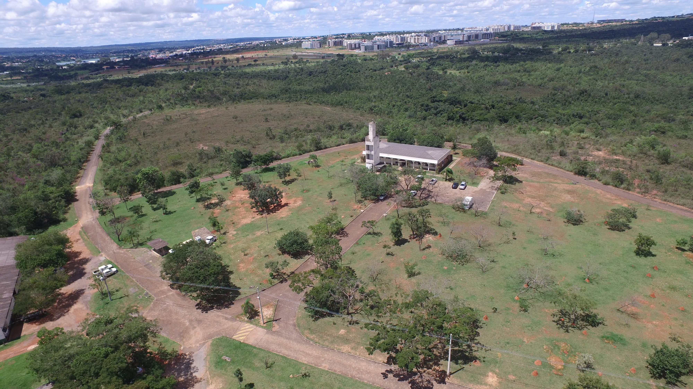

# Coord_Foto
Coloca em uma foto obtida por drone as coordenadas LAT, LON e Altura relativa e absoluta.

# Display_Coords
Batch images GNSS diplay coordinaates, absolute and relative altitude over georreferenced JPGs, based on ***Coord_Foto.exe*** `Coord_Foto.exe` [[link]](https://github.com/harleyham/Coord_Foto).

## 01 - Dependences

A Miniconda [[link]](https://docs.conda.io/projects/miniconda/en/latest/miniconda-install.html) Python enviroment was create with 3.7.13 Python version and with the following main packages:
* os
* subprocess

## 02 - Images Samples

Three types of samples are located in the "images" folder, like the following folders:

* General

    

* H20T Wide and Zoom

  
    

* L1

    

## 03 - References

 * https://github.com/harleyham/Coord_Foto