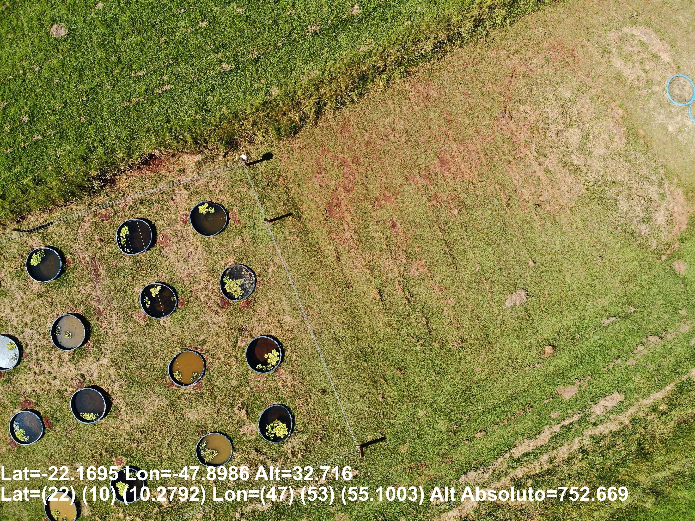

# Display_Coords
Windows OS Batch images GNSS diplay coordinaates, absolute and relative altitude over georreferenced JPGs, based on `Coord_Foto.exe` [[link]](https://github.com/harleyham/Coord_Foto).

## 01 - Dependences

A Miniconda [[link]](https://docs.conda.io/projects/miniconda/en/latest/miniconda-install.html) Python enviroment was create with 3.7.13 Python version and with the following packages:
* os
* subprocess

## 02 - Images Samples

Three types of samples are located in the `images` folder, like the following folders:

* General

    

* H20T Wide and Zoom

  
    

* L1

    

Before run the batch display is necessary to cofigure the imagens folders in the `Display_Coords_Batch.py` line:
`images_dir = "./images/L1"  # Images Path: "L1", "H20T", "General", and others`

After that, just run  `Display_Coords_Batch.py`.

It's possible to run a single image by Window OS Terminal command:
`C:\WindowsFolder>Coord_Foto.exe ./images/H20T/DJI_20240502112809_0010_W_point1.JPG`

* DJI_20240502112809_0010_W_point1.JPG **original**

    

* DJI_20240502112809_0010_W_point1_coord.JPG **with coordinates and altitudes**

    

## 03 - References

 * https://github.com/harleyham/Coord_Foto